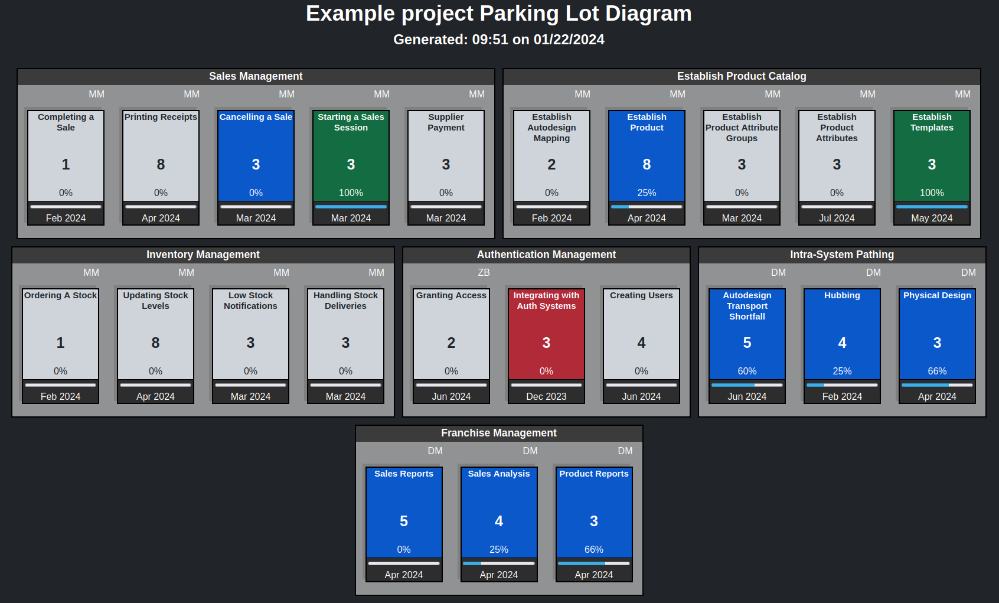

# Parking Lot Generator

## Summary
Parking lot diagrams are used in Feture Driven Development (FDD) to visualize a rolled up project status. In addition to FDD projects, Parking lot diagrams also may be useful on XP or Scrum projects. To read more about parking lot diagrams, see <a href="http://leadinganswers.typepad.com/leading_answers/2007/02/summarizing_pro.html" target="_blank">Summarizing Progress with Parking Lot Diagrams</a>.

This documentation is a little sparse. In between now and when I can fill it out, feel free to contact me with any questions.

## Dependencies
This application is packaged with <a href="https://getcomposer.org/doc/00-intro.md" target="_blank">Composer</a> and built using <a href="https://github.com/box-project/box2" target="_blank">Box</a>. The Makefile assumes that the box executible is in your path

## Parking Lot Diagram
A parking lot diagram is a high-level visualization of a project status. Traditionally, parking lot diagrams represent Feature Areas, Feature Sets, and Features. This may be analogous to a hierarchy of Epics, Features, and Stories.  

### Example Parking Lot Diagram


## Building
To build, run 'composer install' in the top level directory. Then run 'make'. The executable will be built to bin/ParkingLotGenerator.phar. Again, the make file assumes that the box executible is in your path (and named 'box', not box.phar).

## Usage

### Configuration

The configuration file describes the feature areas, feature sets, and features from which the parking lot diagram will be built. 
 
**Feature Areas** - Feature areas consist of a unique name and an array of feature sets.

**Feature Sets** - Feature sets consist of a feature set name (unique to the feature area), owner, and an array of features.

**Features** - Features consist of a feature name (unique to the feature set), due date, and status. The due date should be in the format "mm/dd/YYYY". The status may be "Open", "In Progress", or "Completed".

#### Example
```json
{
    "feature areas": [
        {
            "name": "Feature Area 1",
            "featureSets": [
                {
                    "name: "Feature Set 1",
                    "owner": "MSS",
                    "features": [
                        {
                            "name": "feature 1",
                            "dueDate": "01/07/2017",
                            "status": "Open"
                        },
                        {
                            "name": "feature 2",
                            "dueDate": "01/07/2017",
                            "status": "In Progress"
                        },
                        {
                            "name": "feature 2",
                            "dueDate": "01/07/2017",
                            "status": "Completed"
                        }
                    ]
                }
            ]
        }
    ]
}
```

### Execution
Run php bin/ParkingLotGenerator.phar --help for the help
~~~
Description:
  Generates a Parking Lot diagram from an input CSV.

Usage:
  php ParkingLotGenerator.phar -h | --help
  php ParkingLotGenerator.phar --version
  php ParkingLotGenerator.phar --input <file path> [--output <file_path>]

Options:
  -h --help                           Show Help
  --version                           Show the version and git commit of this build
  --project-name                      The name of the project
  --input                             The input json file
  --output                            Optional output file (default: './parking_lot.html')

Output: Outputs an html file that contains a ParkingLot Diagram
~~~

#### Example
`php bin/ParkingLotGenerator.phar --project-name "Example Project" --input "$HOME/example.json" --output "/var/www/html/parking_lot.html"`

#### Note
You will need to copy assets/css/style.css to the same destination directory as your output html.

## Known issues and shortcomings 

* I'm not all that great with CSS. The generated report could probably use a face lift.
    * No attempt has been made to ensure a consistent look and feel across different browsers.
* The style.css must be manually copied to the destination directory.
* While there is some input validation, it's not as robust as it could be. The input config file could be better validated.
    * <span style="color:red">WARNING</span>: The Parking Lot Generator is currently vulnerable to XSS and other attacks as the input file is assumed to be trusted.
* There are currently no application level configuration options (e.g. the report title and "Generated" message are not configurable)
* This documentation is a little sparse. In between now and when I can fill it out, feel free to contact me with any questions.
